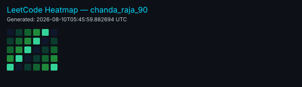

<div align="center">
  
# Hi there!  I'm Vishwanath Raja Chanda

### 🚀 Full-Stack Developer | AI Enthusiast | Tech Innovator
### 🎓 B.Tech CSE @ VNRVJIET | Building the Future, One Line at a Time


[](https://git.io/typing-svg)

<p align="center">
  
  
  
  
  
</p>

</div>

---
---

## 🚀 About Me


```typescript
const rajachanda = {
    pronouns: "He" | "Him",
    code: ["JavaScript", "TypeScript", "Python", "Java", "C++", "Go"],
    askMeAbout: ["web dev", "tech", "app dev", "AI/ML", "competitive programming"],
    technologies: {
        frontEnd: {
            js: ["React", "Next.js", "Angular"],
            css: ["Tailwind", "Bootstrap", "Styled-Components"]
        },
        backEnd: {
            js: ["Node.js", "Express"],
            python: ["Django", "Flask", "FastAPI"],
            databases: ["MongoDB", "PostgreSQL", "MySQL", "Firebase"]
        },
        mobile: ["Flutter", "React Native"],
        devOps: ["Docker", "Vercel", "Netlify", "GCP"],
        ai: ["TensorFlow", "PyTorch", "Scikit-learn", "OpenAI APIs"]
    },
    currentFocus: "Building Full-Stack Applications with AI Integration",
    funFact: "I debug code better with coffee ☕"
};
```

### 🎯 Current Goals
- 🔭 Working on **Innovative Web + AI Projects**
- 🌱 Mastering **MERN Stack, Flutter, Golang & Competitive Programming**
- 👯 Open to collaborate on **Full Stack & AI/ML Projects**
- 🤔 Actively seeking **Software Development Internships**
- 💬 Ask me anything about **Tech, Development, or Life** [here](https://github.com/rajachanda/rajachanda/issues)
- ⚡ Fun fact: **I can code for hours but forget to eat lunch!** 😄

---
---

## 💼 Experience

### 📊 Full Stack Developer Intern — Apslion Labs

Worked on a RAG-based AI property assistant and production features for a MERN property platform.

Contributions

- 📡 Built Retrieval-Augmented Generation pipelines for contextual property insights and recommendations
- 🧩 Integrated vector embeddings, retrieval, and LLM responses for better user guidance
- 🖥️ Implemented frontend components and connected the RAG backend to MERN interfaces
- ⚙️ Helped productionize workflows and improve data retrieval accuracy

### 📊 Software Engineering Intern — PSNM Innovations

Worked across staging and workflow automation using Supabase and deployment tools.

Contributions

- 🔄 Managed staging environment and cross-role workflows for the core website
- 🗃️ Used Supabase for backend operations and data management
- 🛠️ Automated deployment and development workflows; improved dev-to-prod handoffs

---

## 🏆 Leadership

### 👨‍💼 CSI Student Chapter — Technical Lead / Head

Led technical initiatives, events, and student developer programs at the CSI chapter (VNR VJIET).

Highlights

- 💻 Organized coding contests and campus hackathons
- 🤖 Ran AI Week 2K26 workshops and hands-on sessions
- 👥 Coordinated multi-person technical teams and volunteer organizers
- 🎯 Managed event logistics, outreach, and execution
- 🌱 Built a collaborative student developer community through mentorship and workshops

Leadership taught me that building great products isn't only about writing code — it's about ownership, communication, and consistent execution.

```
Ownership
Communication
Consistency
Collaboration
Execution
```


## 🌟 Featured Projects

<table>
<tr>

<td width="50%" valign="top">

### 🛡️ JUSTra

#### AI-Assisted Complaint Triage Platform

AI-powered complaint triage platform for workplace harassment reporting, evidence enrichment, and decision support.

**⚡ Features**

- 🕵️ Anonymous complaint intake
- 🤖 LLM-powered complaint triage
- 📄 Evidence OCR & summarization
- 🧠 RAG-based decision support
- 👥 Multi-persona dashboards
- 🔐 Role-based access control

**🛠️ Stack**

`Next.js` `Supabase` `Groq` `Python` `RAG` `Telegram`

🏆 **1st Place · Designathon 4.0**

[🔗 View Project](https://github.com/rajachanda/Justra)

</td>

<td width="50%" valign="top">

### ⛏️ MINERVA

#### AI-Powered Mining Safety Platform

AI-powered mining safety solution combining computer vision, IoT, and role-based monitoring to improve worker safety.

**⚡ Features**

- 🦺 Real-time PPE detection
- 🚨 Hazard monitoring
- 🪖 Smart IoT helmets
- 🆘 Emergency SOS system
- 🔥 Fire detection
- 👥 Multi-role dashboards

**🛠️ Stack**

`React Native` `FastAPI` `YOLOv8` `ESP32` `Firebase` `PyTorch`

🏆 **Smart India Hackathon Grand Finale Winner**

[🔗 View Project](https://github.com/rajachanda/SIH-Minerva)

</td>

</tr>

<tr>

<td width="50%" valign="top">

### 🎬 Webathon4

#### CinYstore · Film Distribution Intelligence

AI-powered film distribution and marketing intelligence platform with poster analysis, release-window intelligence, and audience buzz tracking.

**⚡ Features**

- 🎨 AI poster scoring
- 📊 Buzz analytics
- 🗓️ Release window heatmaps
- 📺 YouTube & social metrics
- 📈 Competition analysis
- 🎯 Campaign blueprints

**🛠️ Stack**

`React` `Node.js` `Supabase` `Python` `ML`

[🔗 View Project](https://github.com/rajachanda/Webathon4)

</td>

<td width="50%" valign="top">

### 🎮 HAVIT

#### RPG-Style Habit Tracker

Gamified habit management platform that turns everyday habits into an RPG experience with AI coaching and social competition.

**⚡ Features**

- 🧙 9-level character evolution
- 🤖 AI Sage coach
- ⚔️ Friend challenges
- ⭐ XP progression system
- 🏆 Real-time leaderboards
- 🔥 Social competition

**🛠️ Stack**

`React` `TypeScript` `Firebase` `Gemini AI` `Express`

[🔗 View Project](https://github.com/rajachanda/HAVIT)

</td>

</tr>

<tr>

<td width="50%" valign="top">

### 🎯 AI Career Coach

#### Intelligent Career Guidance Platform

Next.js-powered career platform that provides personalized career recommendations and identifies skill gaps.

**⚡ Features**

- 🧭 Career path recommendations
- 📊 Skill gap analysis
- 🤖 AI-powered guidance
- 🎓 Personalized learning paths
- 📈 Career progress tracking

**🛠️ Stack**

`Next.js` `TypeScript` `AI` `Tailwind CSS`

[🔗 View Project](https://github.com/rajachanda/ai-career-coach)

</td>

<td width="50%" valign="top">

### 🎤 AI Interview Trainer

#### Real-Time AI Mock Interview Platform

Interactive mock interview platform that analyzes responses and provides AI-powered feedback.

**⚡ Features**

- 🎙️ Mock interviews
- 🤖 Real-time AI feedback
- 📹 Interview recording
- 📊 Performance analytics
- 💡 Improvement suggestions

**🛠️ Stack**

`React` `Node.js` `MongoDB` `OpenAI API`

[🔗 View Project](https://github.com/rajachanda/ai-interview-trainer)

</td>

</tr>

<tr>

<td width="50%" valign="top">

### 🏠 Property Discovery

#### AI-Powered Real Estate Marketplace

Real estate marketplace combining intelligent recommendations, verified listings, location-based discovery, and payments.

**⚡ Features**

- 🤖 AI recommendations
- 🏠 Verified listings
- 🔎 Advanced property search
- 📍 Google Maps integration
- 💳 Payment gateway
- 📊 Property insights

**🛠️ Stack**

`MERN` `AI/ML` `Google Maps` `Payments`

[🔗 View Project](https://github.com/rajachanda/property-discovery)

</td>

<td width="50%" valign="top">

### 🔗 PERMA

#### Link-in-Bio Analytics Platform

Next-generation link-in-bio platform with custom URLs, engagement tracking, and detailed analytics.

**⚡ Features**

- 🔗 Custom URLs
- 📊 Engagement tracking
- 📈 Analytics dashboard
- 🔐 JWT authentication
- ⚡ Link management

**🛠️ Stack**

`React 19` `Vite` `Express` `MongoDB` `JWT`

[🔗 View Project](https://github.com/rajachanda/perma-platform)

</td>

</tr>

<tr>

<td width="50%" valign="top">

### 🚌 Bus Pass Automation

#### Digital Bus Pass Management System

Digital bus pass platform built for VNR VJIET with online payments and QR-based verification.

**⚡ Features**

- 💳 Online payments
- 🎫 Digital bus passes
- 📱 QR verification
- 👨‍💼 Admin dashboard
- 📄 Paperless workflow

**🛠️ Stack**

`MERN` `Razorpay` `QR Code` `Admin Panel`

🟢 **College Deployed**

[🔗 View Project](https://github.com/rajachanda/bus-pass-automation)

</td>

<td width="50%" valign="top">

### ♻️ coSmart

#### Smart Waste Management Platform

Smart waste management ecosystem connecting citizens, Green Champions, and ULB officers through technology and data.

**⚡ Features**

- ♻️ Citizen engagement
- 🌱 Green Champion verification
- 📊 ULB analytics
- 🗑️ Smart waste monitoring
- 📡 IoT integration
- 🎁 Reward system

**🛠️ Stack**

`MERN` `IoT` `Chart.js` `JWT`

[🔗 View Project](https://github.com/gaddalecharmi/SIH-2k25)

</td>

</tr>

<tr>

<td width="50%" valign="top">

### 🎵 Little Musicians Academy

#### Music Education Platform

Non-profit music education platform designed to make quality music learning accessible to children.

**⚡ Features**

- 🎼 Course showcase
- 📱 Responsive design
- 💬 Testimonials
- ♿ Accessibility-focused UI
- 🎨 Interactive interface

**🛠️ Stack**

`React` `TypeScript` `Vite` `Tailwind CSS` `shadcn/ui`

[🔗 View Project](https://github.com/rajachanda/crescendo-academy-web-main)

</td>

<td width="50%" valign="top">

### ⚡ FlashForte 2K25

#### CSI VNR VJIET Technical Event Website

Official website for the CSI VNR VJIET technical event with registration and interactive experiences.

**⚡ Features**

- 📝 Event registration
- 📅 Event schedules
- 🎨 Interactive UI
- ✨ Motion animations
- 📱 Responsive design

**🛠️ Stack**

`React` `Tailwind CSS` `Framer Motion` `Firebase`

[🔗 View Project](https://github.com/rajachanda/flashforte-2k25)

</td>

</tr>

<tr>

<td width="50%" valign="top">

### 💰 Expense Tracker Pro

#### Personal Finance Management Platform

Full-featured financial management application for tracking expenses, budgets, and spending patterns.

**⚡ Features**

- 💸 Expense tracking
- 📊 Data visualization
- 🎯 Budget management
- 🚨 Budget alerts
- 📈 Spending analytics

**🛠️ Stack**

`React` `Node.js` `MongoDB` `Chart.js`

[🔗 View Project](https://github.com/rajachanda/expense-tracker)

</td>

<td width="50%" valign="top">

### 🎫 Event Management System

#### Full-Stack Event Platform

Complete event management platform supporting registration, attendance tracking, payments, and certificates.

**⚡ Features**

- 📝 Event registration
- 👥 Attendance tracking
- 🎟️ Certificate generation
- 💳 Payment integration
- 📧 Email notifications

**🛠️ Stack**

`MERN` `Payment Integration` `Email Service`

[🔗 View Project](https://github.com/rajachanda/event-manager)

</td>

</tr>

<tr>

<td width="50%" valign="top">

### 📝 Smart TODO

#### Productivity & Task Management Platform

Production-ready task management application combining recurring tasks, Pomodoro sessions, and productivity analytics.

**⚡ Features**

- ✅ Smart task management
- 🔄 Recurring tasks
- 🍅 Pomodoro timer
- 📊 Productivity analytics
- 📅 Task organization

**🛠️ Stack**

`Flask` `React` `PostgreSQL` `REST API`

[🔗 View Project](https://github.com/rajachanda/smart-todo)

</td>

<td width="50%" valign="top">

### 🌐 Developer Portfolio

#### Personal Portfolio Website

Modern developer portfolio showcasing projects, technical skills, achievements, and experience.

**⚡ Features**

- 🎨 Interactive UI
- 🚀 Project showcase
- ✨ Motion animations
- 📱 Responsive design
- 📬 Contact section

**🛠️ Stack**

`React` `Tailwind CSS` `Framer Motion` `Vercel`

[🌐 Live Website](https://rajaportfoli-2vwe.vercel.app/)

</td>

</tr>

</table>

---

### 📊 Project Highlights

| | |
|---|---|
| 🚀 **15+** | Projects Built |
| 🤖 **AI/ML** | Intelligent Applications |
| 🏆 **Hackathons** | Winning Projects |
| 🌐 **Full-Stack** | Web Applications |
| 📱 **Web + Mobile** | Cross-Platform Development |
| ☁️ **Cloud** | Production Deployments |

---

## 🛠️ Tech Arsenal & Skills

<div align="center">

 **What I Work With** 

</div>

### 🎨 **Frontend Mastery**
<p align="center">
  
</p>

### ⚙️ **Backend & Server Technologies**
<p align="center">
  
</p>

### 📱 **Mobile & Cross-Platform**
<p align="center">
  
</p>

### 🗄️ **Database & Storage**
<p align="center">
  
</p>

### ☁️ **Cloud & DevOps**
<p align="center">
  
</p>

### 🤖 **AI & Machine Learning**
<p align="center">
  
  
  
</p>

### 🛠️ **Development Tools & Workflow**
<p align="center">
  
</p>

### 📊 **Programming Languages Proficiency**
<div align="center">
  
| Language | Proficiency | Experience |
|----------|-------------|------------|
| **JavaScript/TypeScript** | ⭐⭐⭐⭐⭐ | 3+ years |
| **Python** | ⭐⭐⭐⭐⭐ | 3+ years |
| **Java** | ⭐⭐⭐⭐ | 2+ years |
| **C++** | ⭐⭐⭐⭐ | 2+ years |
| **Golang** | ⭐⭐⭐ | 1+ year |
| **Dart/Flutter** | ⭐⭐⭐⭐ | 1+ year |

</div>
---
### 🎉 **Special GitHub Achievements**
<div align="center">

<table>
<tr>
<td align="center" width="33%">

<br><strong>🦈 Pull Shark x3</strong>
<br><em>Merged multiple PRs</em>
<br><code>Silver Level — 128 merges</code>
</td>
<td align="center" width="33%">

<br><strong>💖 YOLO</strong>
<br><em>Merged without review</em>
<br><code>Achieved</code>
</td>
<td align="center" width="33%">

<br><strong>⚡ Quick Draw</strong>
<br><em>Fast response time</em>
<br><code>Active</code>
</td>
</tr>
</table>

**🏆 Achievement Highlights:**
- 🦈 **Pull Shark (Silver)** - Merged **128** pull requests
- 💖 **YOLO Badge** - Demonstrates confidence in code quality
- 🌟 **PRO Status** - Access to advanced GitHub features
- 📁 **Organization Member** - Collaborative team player

</div>

### 🏅 **Profile Highlights**
<div align="center">
  


</div>

---

### 🧩 DSA & Competitive Programming

<p align="center">

<a href="https://leetcode.com/u/chanda_raja_90/" target="_blank">
  
</a>

</p>

<p align="center">
  <!-- Local fallback heatmap (generated by workflow) -->
  
</p>

<p align="center">
<a href="https://leetcode.com/u/chanda_raja_90/" target="_blank">
  
</a>
</p>

<!-- LC_STATS_START -->
```txt
LeetCode Rating  : dynamic (see card)
Problems Solved  : dynamic (see card)
CodeChef         : add your CodeChef handle to show badge
```
<!-- LC_STATS_END -->

I enjoy solving problems that improve:

- logical thinking
- optimization skills
- debugging ability
- system-level intuition

Patterns > memorization.


### 🎯 **Development Focus Areas**
<div align="center">

| 🌟 **Specialization** | 📈 **Progress** | 🎯 **Focus Level** |
|:---|:---:|:---:|
| Full-Stack Web Development |  | 🔥🔥🔥🔥🔥 |
| AI & Machine Learning |  | 🔥🔥🔥🔥 |
| Mobile App Development |  | 🔥🔥🔥🔥 |
| Cloud & DevOps |  | 🔥🔥🔥 |
| Competitive Programming |  | 🔥🔥🔥 |

</div>

---

## 📈 Contribution Graphs

### 📅 **Contribution Snake Animation**
<div align="center">
  


</div>

### 📊 **Contribution Activity Graph**
<div align="center">
  


</div>

---

## 🤝 Let's Build Something Amazing Together!

<div align="center">

### 🌐 **Connect With Me**

<a href="https://www.linkedin.com/in/vishwanath-raja-chanda-43888a28b/" target="_blank">
  
</a>
<a href="mailto:rajachanda1105@gmail.com" target="_blank">
  
</a>
<a href="https://github.com/rajachanda" target="_blank">
  
</a>
<a href="https://x.com/ChandaRaja6" target="_blank">
  
</a>
<a href="https://www.instagram.com/chanda_raja_90/" target="_blank">
  
</a>
<a href="https://leetcode.com/u/chanda_raja_90/" target="_blank">
  
</a>
<a href="https://www.codechef.com/users/rajachanda1105" target="_blank">
  
</a>

</div>

### 💼 **Open for Opportunities**
<div align="center">

```yaml
Currently Looking For: 
  - Software Development Internships 🎯
  - Full-Stack Development Projects 💻
  - AI/ML Collaboration Opportunities 🤖
  - Open Source Contributions 🌟
  - Freelance Web Development 💼

Available For:
  - Remote Work ✅
  - Part-time Projects ✅  
  - Hackathons & Competitions ✅
  - Mentoring Junior Developers ✅
```

</div>

### 🎯 **Call to Action**
<div align="center">

[](https://rajaportfoli-2vwe.vercel.app/)
[](https://drive.google.com/file/d/1ED2wgGHL3ICVDfeRq3dEpsktRPSQ46O_/view?usp=sharing)
[](mailto:rajachanda1105@gmail.com)

**📧 Email:** [rajachanda1105@gmail.com](mailto:rajachanda1105@gmail.com)  
**💬 Let's chat about:** `Full-Stack Development` `AI Projects` `Tech Innovation` `Collaboration`

</div>

---

<div align="center">

### 🌟 **Final Words**


**"Code is like humor. When you have to explain it, it's bad."** - Cory House

 <em><b>I love connecting with different people</b> so if you want to say <b>hi, I'll be happy to meet you more!</b> 😊</em>

---


</div>
